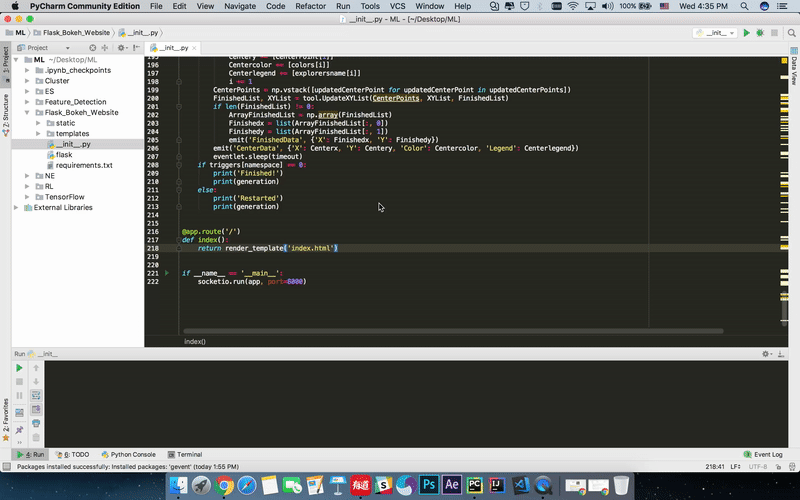
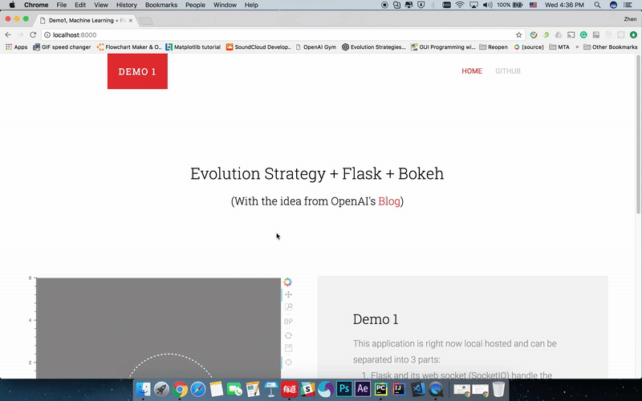
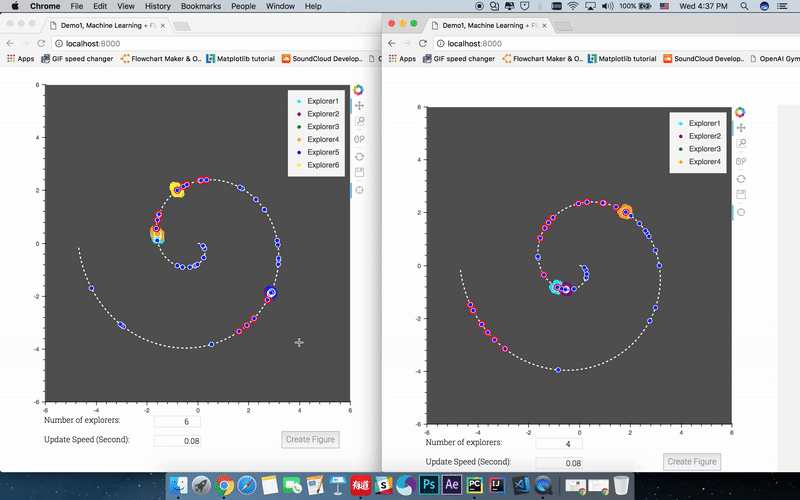

This is a real time data streaming application and can be separated into 3 parts:

1. Flask and its web socket module (SocketIO) handle the server part and the hand shake between frontend and backend.
2. Bokeh (a python package of PyData stack) to build the interactive frontend application.
3. Evolution Strategy algorithm for the functional part. (for more about the Evolution Strategy algorithm, please check my <a href="https://github.com/yz6028693/Evolution_Strategy_with_Archimedean_Spiral" target="_blank">another repository</a>)

Python 3.5 is used in this demo

Python packages needed:
  flask,
  flask_socketio,
  eventlet,
  & numpy

Steps:
1. Clone or download whole repository (make sure the templates and static folders and the __init__.py file are in same folder)
2. Run the __init__.py file
3. The application can be accessed at http://localhost:8000/

Demos shows below:

1. Run the '__init__.py' file:

2. What the application looks like:

3. When two clients run this application at same time: (different clients will not affect each other)

